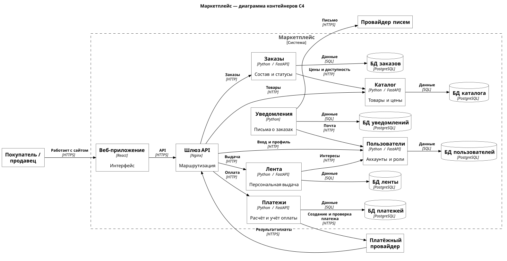
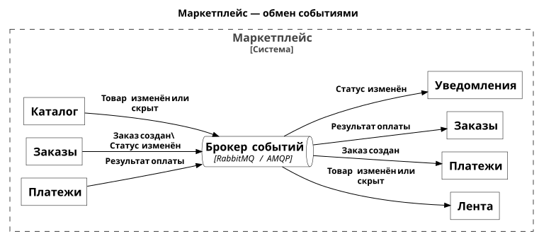

# Архитектура маркетплейса

## Запуск

Из корня репозитория:

```sh
cd hw1
docker compose up --build -d
curl --fail -i http://127.0.0.1:8080/health
```

Нужны запущенный Docker и Docker Compose. Ожидается `200 OK` и
`{"status":"ok"}`. Сервис слушает порт 8080.

Логи и остановка:

```sh
docker compose logs orders
docker compose down
```

Docker здесь не запускался. Перед сдачей надо проверить сборку и запуск.

## Диаграмма контейнеров C4



[Открыть схему](docs/diagrams/containers.svg)

На первой схеме показаны сервисы, их базы и синхронные запросы.
Рамка — граница маркетплейса. В C4 контейнер — приложение или хранилище.



[Открыть схему событий](docs/diagrams/events.svg)

На второй схеме показаны только события через RabbitMQ.
Повторяющиеся названия обозначают один и тот же сервис.

## Предположения

В одном заказе товары одного продавца. Валюта — RUB, оплата полная,
уведомления — по email. Склады, доставка, скидки, комиссии и возвраты
не рассматриваются. Доступность товара задаётся признаком в каталоге.
Данные карт обрабатывает внешний провайдер. Нагрузка в условии не задана.

## Домены и данные

Каждому домену соответствует отдельный сервис со своей PostgreSQL.
Чужую БД читать нельзя: данные получаем через API или события.
Общих таблиц и межсервисных SQL-запросов нет.

- **Пользователи.** Аккаунты, вход, роли покупателя и продавца, интересы.
  Хранит учётные записи, хеши паролей, роли, контакты и выбранные категории.
- **Каталог.** Добавление и изменение товаров продавца.
  Хранит товары, продавцов, категории, описания, цены и доступность.
- **Лента.** Подбор и порядок товаров в выдаче.
  Хранит копию карточек, просмотры, клики, оценки интересов и популярность.
- **Заказы.** Оформление, состав, сумма и статусы заказа.
  Хранит покупателя, продавца, позиции, снимки цен, итог и историю статусов.
- **Платежи.** Расчёт суммы оплаты, создание платежа и учёт результата.
  Хранит суммы, валюту, попытки, статусы, ключи повторных запросов и номера платежей провайдера.
- **Уведомления.** Письма о статусах заказа.
  Хранит задания, адреса и тексты писем, результаты отправки и число попыток.

Каталог хранит актуальные цены. Заказы сохраняют цены на момент покупки:
изменение товара не меняет старый заказ. Платежи считают сумму по этим
позициям и сверяют её с итогом заказа. Суммы хранятся в копейках, без float.
Копия карточек в ленте обновляется по событиям и может немного отставать.

Лента отделена от каталога, чтобы менять выдачу и масштабировать чтение отдельно.
Платежи выделены из-за внешнего провайдера и отдельного учёта денег.
Уведомления выделены, чтобы ошибки отправки писем не мешали заказам.
Пользователи хранят роли; права на конкретный товар или заказ проверяет его сервис.

Веб-приложение хранит временное состояние интерфейса. Шлюз API направляет
запросы и не имеет бизнес-БД. RabbitMQ хранит очереди событий.

## Персонализация

Сначала показываем товары из выбранных и часто просматриваемых категорий,
внутри них — популярные по просмотрам за семь дней. Новому пользователю
показываем общую популярную выдачу. Если просмотров ещё нет — новые товары.
Перед покупкой цена и доступность проверяются в каталоге.

## Взаимодействия

### Синхронные

Покупатель и продавец работают с веб-приложением по HTTPS. Оно вызывает
через шлюз API пользователей, каталога, ленты, заказов и платежей.
Снаружи используется HTTPS, внутри — HTTP с JSON.

Между сервисами тоже HTTP с JSON:

- Лента запрашивает выбранные интересы у пользователей.
- Заказы проверяют актуальные цены и доступность в каталоге.
- Уведомления получают email у пользователей.

Платежи создают платёж и проверяют его состояние у провайдера по HTTPS с JSON.
Покупатель оплачивает заказ на странице провайдера по HTTPS.
Провайдер передаёт результат через шлюз в платежи с помощью webhook.
Уведомления передают письмо провайдеру по HTTPS с JSON, тот доставляет его по email.
Каждый сервис читает и изменяет свою БД через SQL.

Webhook приходит позже начала оплаты: результат асинхронный,
но сам webhook — HTTPS-запрос с ответом.

### Асинхронные

Все события идут через RabbitMQ по AMQP. У каждого получателя своя очередь.

- Каталог сообщает ленте, что товар изменён или скрыт.
- Заказы сообщают платежам о создании заказа.
- Платежи сообщают заказам об успешной или неуспешной оплате.
- Заказы сообщают уведомлениям об изменении статуса.

Заказ сначала ждёт оплаты. Платежи создают ссылку на страницу провайдера.
После проверки результата оплаты заказы меняют статус и уведомляют покупателя.
Возврат браузера на сайт не подтверждает оплату.

Изменение данных и событие сохраняются вместе в БД отправителя.
Получатель запоминает номер события, чтобы повтор не изменил данные дважды.
Неясный результат платежа сверяется с провайдером; повтор использует тот же
ключ идемпотентности. Сбой письма не отменяет заказ.

## Варианты разбиения

**Модульный монолит:** шесть модулей в одном приложении, одна БД с отдельными схемами.
Плюсы — один запуск и релиз, проще отладка, внутренние изменения можно выполнить
одной транзакцией. Минусы — лента масштабируется вместе со всем приложением,
сбой и релиз затрагивают все домены.

**Шесть сервисов:** по одному на домен, у каждого своя БД.
Плюсы — независимые изменения и масштабирование, явные владельцы данных,
изоляция писем и платежей. Минусы — больше приложений и БД, сетевые ошибки,
задержки событий и необходимость обрабатывать повторы.

Монолит проще сопровождать, но части связаны общим процессом и релизом.
Сервисы дают независимость, но усложняют запуск и согласование данных.
Внешний провайдер остаётся вне транзакции БД в обоих вариантах.

**Выбраны шесть сервисов.** Лента обслуживает чтение, каталог — изменения
товаров, заказы — условия покупки, платежи — деньги, уведомления — письма.
Отдельные границы позволяют менять эти части независимо и не связывать
оформление заказа с отправкой писем. Цена при покупке проверяется сразу,
а лента и уведомления могут обновиться позже.

Для небольшой команды монолит был бы проще. Но здесь проектируется вся
система, а по условию запускается только один каркас. Поэтому в Compose
нет остальных сервисов, баз и брокера.
